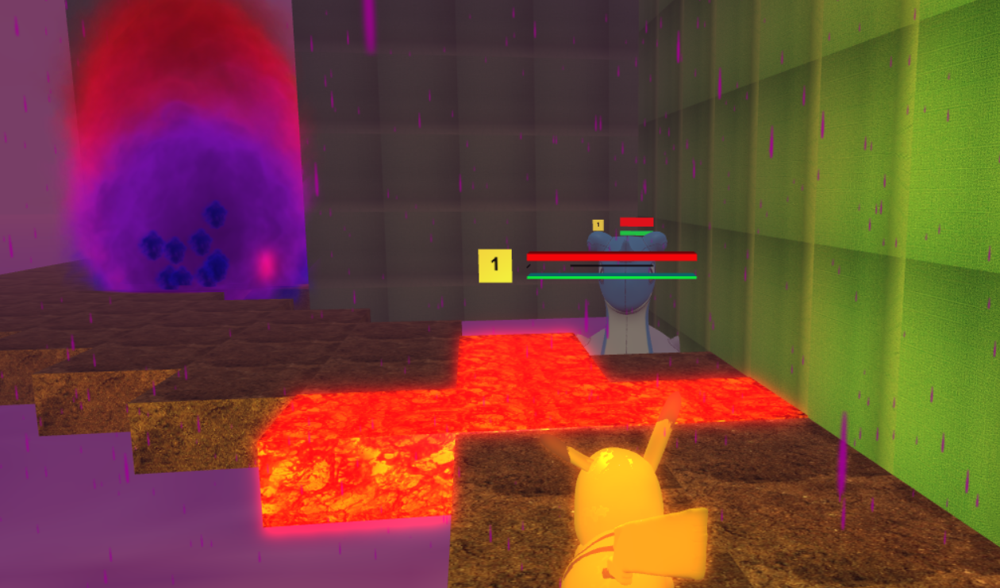
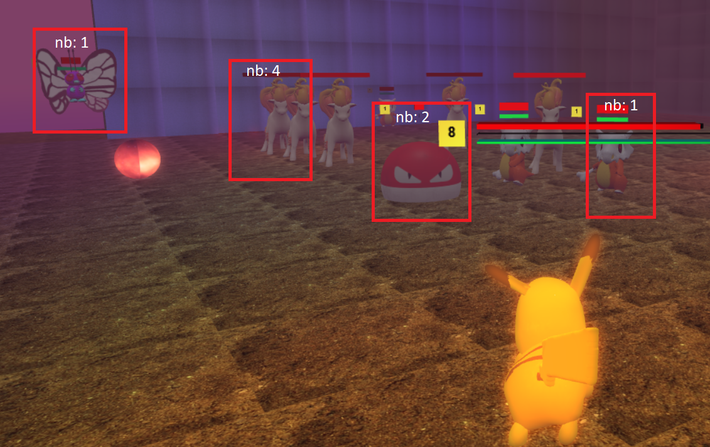
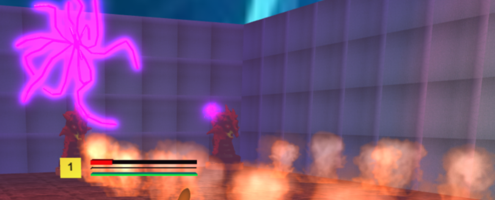
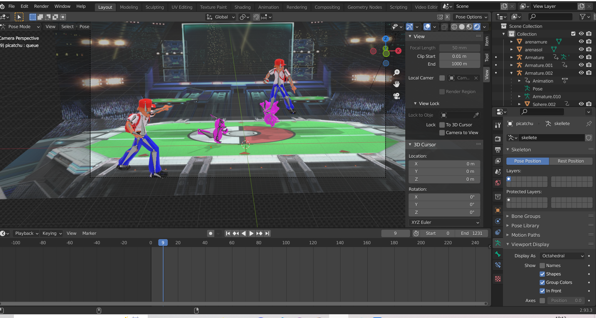
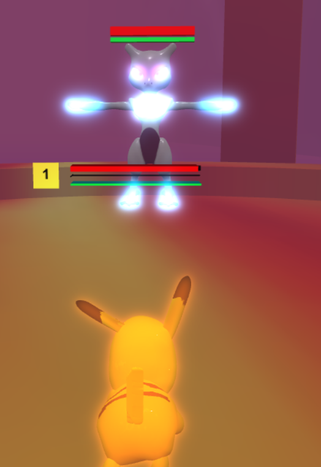

                                                     # BattlePoc
                                                Game Concours Babylonjs

Créateurs:
Matthis Kuhl, Ahmed El Hanafi Si Dehbi

Concept de jeu:

Le jeu s'inspire du monde pokemon, il est mode un joueur et vous êtes pikatchu.
Vous devez vous battre contre les autres pokemons et surtout contre le redoutable pokemon boss Mewtwo.
La map est générée aléatoirement avec un algorithme reliant les salles positionnées au hasard avec des chemins.
Il y a plusieurs ennemis qu'on peut retrouver dans les salles.
Les salles se rechargent à chaque fois que vous y entrez dedans.
Vous gagnez des expériences et donc des niveaux pour chaque victoire sur un pokemon.
De plus la difficulté des salles augmente avec le gain de niveau.

L'histoire:

Nous jouons dans un monde où Mewtwo a décidé de faire disparaître tous les humains sur terre et de les effacer de la mémoire des pokemons. Pikatchu est le dernier à avoir des souvenirs et se met à la conquête pour le retour des humains.
Les autres pokemons et leur environement vont rendre cette conquête difficile arrivera-t-il à ses fins ?
C'est à vous de sauver ce monde.

Règles du jeu:
Il ne faut pas rester dans l'eau sinon on perdra vite connaissance.
Le but est de battre les autres pokemons afin de gagner en expérience puis battre le boss mewtwo qui se trouve de l'autre côté de la map.

Lien video d'un montage de game play du jeu :
https://youtu.be/gvQq46K9cbI

Lien d'hébergement du jeu:
https://kuhlmatthis.github.io/BattlePoK/

Menu:

Le menu est une interface babylonjs scene rendered au début on peut appuier sur:

Play pour démarrer la vidéo et puis jouer par la suite
Replay pour lancer une partie sans vidéo 
Informations pour obtenir les informations de jeu nécéssaires.
Quit: pour sortir du jeu.

Si le jeu est lancé avec la touche p on revient sur la scène du menu et avec play on continue le jeu, replay on lance un nouveau jeu.

Creation de la map:

On a défini un carreau 50 50 qui est la map de notre jeu.
Chaque salle est un rectange fixé à une position x et y de longueur 20.
Pour positionner:
tant que existe salle à placer:
On prend un point au hasard dans la map et on vérifie qu'il ne se croise pas avec une salle déjà existante.
En fonction du résultat précédant on rajoute la salle et on diminue les salles à créer ou sinon on continue à boucler.

Pour créer les chemins on connecte salle 0 à salle 1 puis salle 1 à salle 2 etc.
Pour chaque salle on a defini le point de départ et d'arriver juste devant la porte par la suite on peut calculer le mouvement nécessaire pour le chemin: position x de la salle 1 - position x de la salle 2 et position y de la salle 2 - position y de la salle 2
On va boucler sur ces valeurs et à chaque fois créer les box à la position actuelle puis réduire les valeurs.
Si les valeurs sont à 0 0 on est arrivé chez l'autre salle.

Difficulté: on peut passer à travers des salles entre le point de départ et d'arrivée.
La solution n'est pas si compliquée grâce à la forme d'une salle rectangulaire. Si jamais on croise une salle:
on allonge sur les murs à droite ou à gauche jusqu'au bout puis on avance de un.
Il ne faut pas oublier d'incrémenter les valeurs en fonction afin de prendre en compte qu'on reprend de la distance et revenir dans l'autre sens plus tard.

Générer aléatoirement de la map était compliqué surtout qu'on travaillait avec plusieurs boucles while non trivial pour positionner les salles et créer les chemins.
Donc il fallait comprendre pourquoi ça bouclait souvent à l'infini et donc plantait la page web.

Extérieur:

Pour rendre l'extérieur plus intérressant on a positionné des ennemis au hasard sur la map. Un pokemon d'eau et un volant.
Il fallait vérifier que la création ne se faisait pas sur le chemin en lui-même au risque que les ennemis restent bloqués dans les murs ou que les pokemons d'eau se trouvent sur la surface.
Pour des résultats propres on a découpé la map dans des zones ou on générait un ennemi soit volant soit nageant.
Dans cette zone on choisit une position au hasard et on vérifie grâce à un ray cast qu'il n'y a pas de colision avec un chemin.

Deux problèmes sont que dans les salles le sol n'est pas encore généré donc l'ennemi peut se retrouver dedans et que juste le sol classique soit verifié et non le sol sous forme lave.

Il y a des particules fumés devant l'entrée qui disparaissent et réapparaissent lors de l'entrée sortie de la salle.
Plus concrètement j'ai une box de la taille de salle avec alpha = 0 donc invisible.
Cette box a un actionmanager qui trigger lors de l'entrée ou sortie de cette box et donc va éxecuter plusieurs choses:
1: désactive ou active le système de particules devant l'entrée.
2: désactive ou active le système de particules de la pluie sur pikatchu
3: disable tous les ennemies extérieurs
4: génère le sol et les éléments de l'environnement et ennemis de la salle (suite)

Salle et Ennemi:

La salle en elle-même est générée qu'à l'entrée de pikatchu ce qui augmente les performances.
Il existe trois types de salle:
Salles normales avec le double d'ennemis.
Salles avec de la lave sur le sol.
Salles avec des statues dragons crachant du feu sur une longueur.

Pour détecter la colision de pikatchu avec le sol de lave à chaque frame on lance un rayon du centre de pikatchu vers le sol.
Le rayon est d'une distance à juste toucher un peu le sol comme ça si on saute par dessus pas de problèmes.
Si le rayon touche un objet "lave" il prend des dégats.
L'avantage est que nous contrôlons la colision du côté mobile (pikatchu) et non du côté du sol lave ce qui réduit fortement le nombre de vérification de colision.
Pour le feu craché par le dragon c'est un système de particules pour chaque carreau et une box invisible générée à chaque attaque.
Cette box est prise en compte aussi par le raycast de pikatchu pour prendre des dégâts.

Pour la génération des ennemis une salle calcule une valeur par rapport au niveau de pikatchu cette valeur est des ennemis de la salle. 
Concrètement on boucle tant que la valeur n'est pas égale à 0 et on génère un ennemi au hasard et à un endroit au hasard dans la salle.
Chaque ennemi enlève un nombre précis à cette valeur qui peut varier en fonction de sa puissance.

Il y a dans les salles 4 types d'ennemis:
Le marowak(nb: 1) attaque proche de l'ennemi de base
Le papillon(nb: 2) identité volante qui lance des balles sur le pikatchu (les balles ont un actionmanager on intersect avec box de pikatchu).
La bombe(nb: 3) lorsque cette identité est trop proche elle explose et vous donne un packet dégâts
Le cheval (nb: 4) il court sur vous mais remet son mouvement et vision rarement. Emet des dégâts lors de la colision avec lui.

A l'éxterieur il existe un pokemon d'eau qui ressemble au papillon par contre celui-ci bouge complètement aléatoirement sur le terrain.

Lumière:

Il existe plusieurs types de lumières dans le jeu :
Le soleil la lumière ambiante.
Une lumière de point suivant pikatchu amène effet de profondeur.
Et les lumieres dans les salles qui sont un mesh avec animation et faites avec blender et un point lumière soit vert, bleu ou rouge.
De plus il y a un GlowLayer appliqué sur les meshes (fait briller).

Pikatchu:
Pour la vision du jeu on utilise une FollowCamera celle-ci suit non pas pikatchu mais une boite invisible paranté à pikatchu qui est un peu plus loin et plus en hauteur que pikatchu.
Pikatchu à des animations il peut marcher, courir, attaquer, sauter, perdre.
Il a aussi des barres (rectangle couleur différent) de vie, expérience et d'énergie pour les modifier j'utilise leur scaling et je les déplace un peu (1/2 vers la gauche).
De plus c'est bares sont parenthé à picatchu.
(Pour les ennemis c'est pareil).
Pour l'attaque d'éclairs j'ai un objet qui a une animation d'extension faite sous blender qui apparait à chaque attaque.
Les attaques sont variées, ne coûtent pas d'énergie, font plus de dégâts, sont instantanées (ray casting) ou une boule se propageant etc.
Pour la pluie, elle est attachée à pikatchu, émet dans un rectangle autour de pikatchu.
Les sauts ne sont que autorisés depuis une certaine hauteur celui du sol.
Il y a beaucoup de timing pour incrémenter la vie et l'énergie et gérer les attaquer.

Mesh et video:

Pour les meshes une partie est récuperer sur internet cgtrader.com/ puis souvent repain puis skeletisé et animé en blender par nous-même.*
Puis transformer en fichier babylon.
Puis par la suite pour faire la vidéo j'ai importé tous les pokemon dans un document plainder j'ai créé l'arrière fond avec deux planes puis les animations par la suite j'ai render chaque scène.
Pour assembler j'ai réimporter chaque render rajouter l'écriture et la musique puis ré-render la vidéo complète.
La derniere étape consistait à transformer la vidéo sous forme mp4 l'importer comme VideoTexture dans un plan de taille de l'écran puis il fallait juste fixer la caméra à la bonne position.
Lors du switch du menu à la vidéo on render la scène de la video à la fin on dispose la vidéo et on render la scène du jeu.

Boss:

Pour aller au boss il faut monter l'arène entièrement faite sous blender est exporté.
Problème qu'on a eu des interfaces non parfaitement droites au sol pour un effet visuel on créé des collisions dérangeantes.
Le boss est un ennemi classique avec plus de vie et plus de comportements speciaux:
Il a trois comportements:

1: Se téléporte au hasard sur un rayon pour faire cela on calcule une val x sur le diamètre puis on utilise pytagore pour trouver sa positon y sachant que le rayon et donc le côté le plus long est statique.
A chaque deuxième téléportation balance une balle vers pikatchu.

2:
Se met hors portée de pikatchu et fait tombé des balles du ciel d'au-dessus de pikatchu.
(Il faut rester en mouvement pour les éviter)

3:
Se téléporte sur un rayon plus large et en hauteur puis vole en ligne droite sur pikatchu en le touchant émet des dégâts plusieurs fois.

Mewtwo n'est que attaquable lors de la stratégie 1 et il altèrne entre stratégie 1 puis stratégie 2 ou 3 puis re stratégie 1 ...

Soucis et possibles améliorations:

Les ennemis à l'extérieur peuvent apparaître dans les salles et peuvent bizarrement restés inactifs quelque fois.
Donc il faut vérifier la manipulation des listes des ennemis actifs et bloqués le spon d'ennemis vers les salles.
La vision de la caméra peut être cachée par les rectangles et d'autres éléments du jeu.
Une solution serait de créer un grand cube derrière la caméra qui a un actionmanager et réduit l'alpha à l'entrée dans ce cube et le réaugmente à la sortie des objets.
